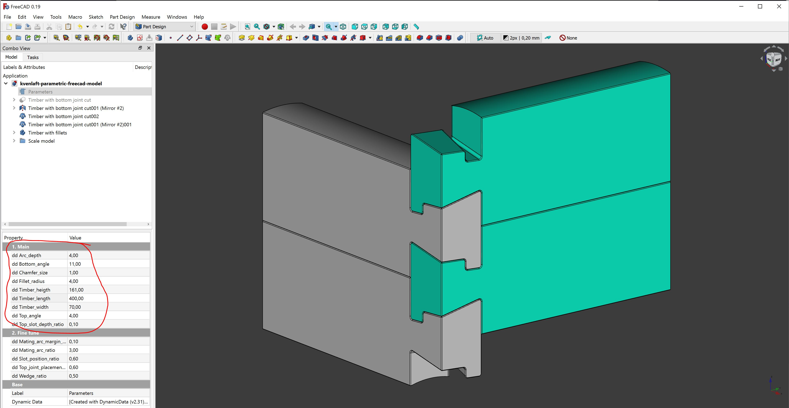
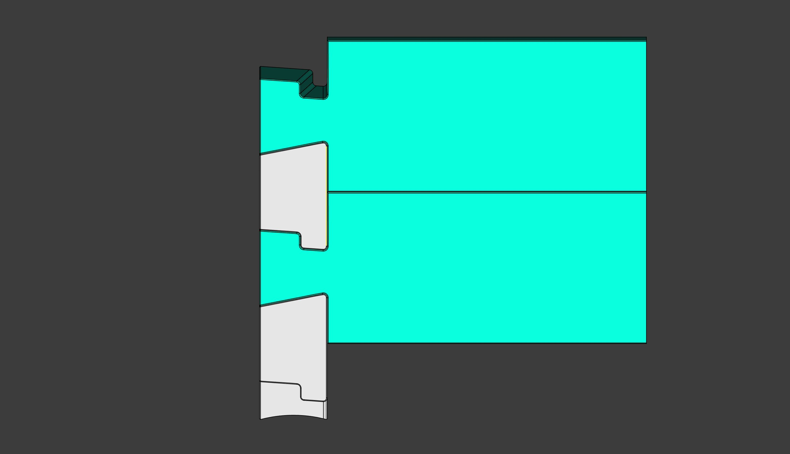
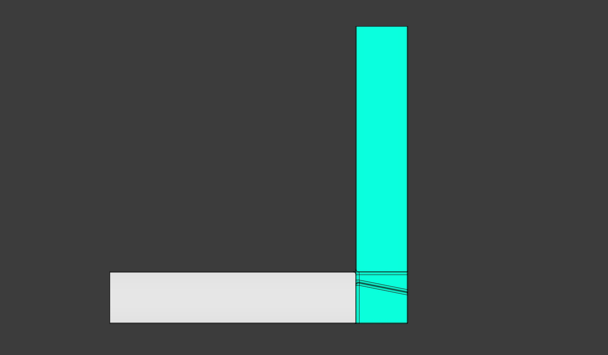
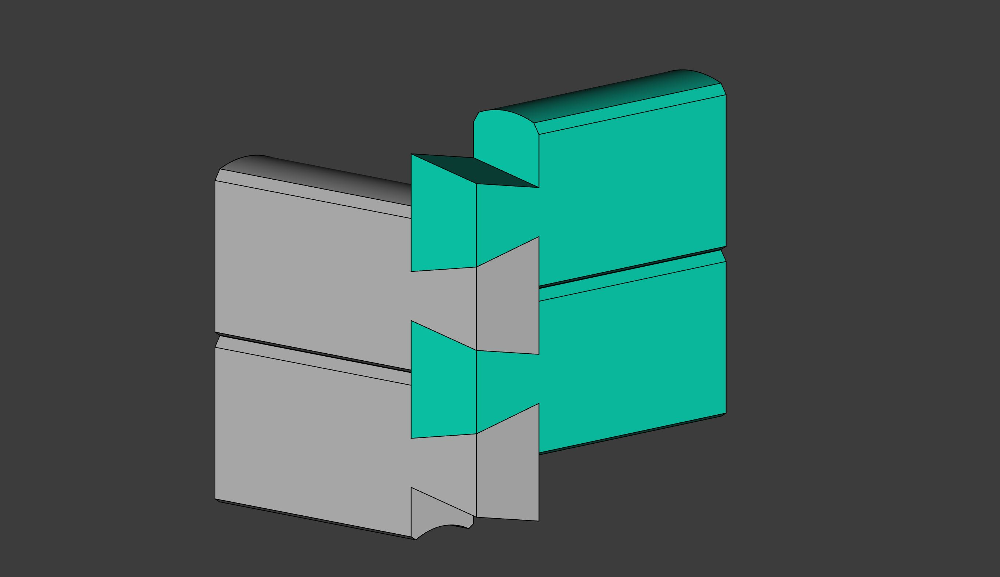

# Kvenlaft

A digital study of traditional kven log house joints

***

The files have been made with Freecad, free open design software. You can download Freecad [here]() to edit the parameters of the file, study or reuse.

